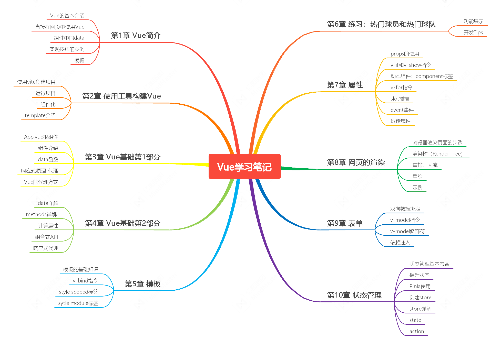

# Vue的学习笔记

&emsp;&emsp;本项目是按照李立超老师的[Vue3.0视频教程](https://www.bilibili.com/video/BV1re4y1M7ko)的学习笔记，老师的原始代码在[这里](https://github.com/lilichao/vue-course)，主要包括：
- 第1章 Vue简介（对应视频P1\~P5）
- 第2章 使用工具构建Vue（对应视频P6\~P9）
- 第3章 Vue基础第1部分（对应视频P10\~P12）
- 第4章 Vue基础第2部分（对应视频P13\~P21）
- 第5章 模板（对应视频P22\~P26）
- 第6章 练习：热门球员和热门球队（对应视频P27\~P29、P34\~P35、P40\~P41）
- 第7章 属性（对应视频P30\~P32、P39、P42\~P48）
- 第8章 网页的渲染（对应视频P37\~P38）
- 第9章 表单（对应视频P49\~P56）
- 第10章 状态管理（对应视频P57\~P66）
- 练习：购物车（对应视频P67\~P85）

## 在线阅读地址

在线阅读地址：https://relph1119.github.io/vue-learning-notes/#/

## 项目目录

<pre>
docs---------------------------------------学习笔记
projects-----------------------------------项目目录
+---basic--------------------------------------直接在网页中使用Vue
+---exercise-----------------------------------练习：热门球员和热门球队
+---hello_vue----------------------------------Hello World程序
+---meals--------------------------------------购物车案例
+---vue_basic01--------------------------------Vue基础第1部分
+---vue_basic02--------------------------------Vue基础第2部分
+---vue_form-----------------------------------表单
+---vue_props----------------------------------属性
+---vue_state----------------------------------状态管理
+---vue_template-------------------------------模板
</pre>

## 环境安装
### Node.js版本
Node v16.1.0

### Vue版本
Vue V3.2.47

### 本地启动docsify
```shell
docsify serve ./docs
```

## 课程知识思维导图



## 总结

&emsp;&emsp;本课程用了大约4天学完（课程总时长约为24个小时，建议大家2倍速度看），学习了Vue的基本内容，做了3个练习（热门球员和热门球队、学生列表、购物车），从总体上了解Vue框架，李立超老师的课程真的很棒，大家可以关注一下。笔记中的大部分内容都是从项目的注释中摘抄下来的，汇集成电子文档，方便大家学习。同时还推荐李立超老师的另外两门课程，分别是[前端基础入门教程 HTML CSS](https://www.bilibili.com/video/BV18T411S71R)和[Node.js完全指南](https://www.bilibili.com/video/BV1qN4y1A7jM)。
