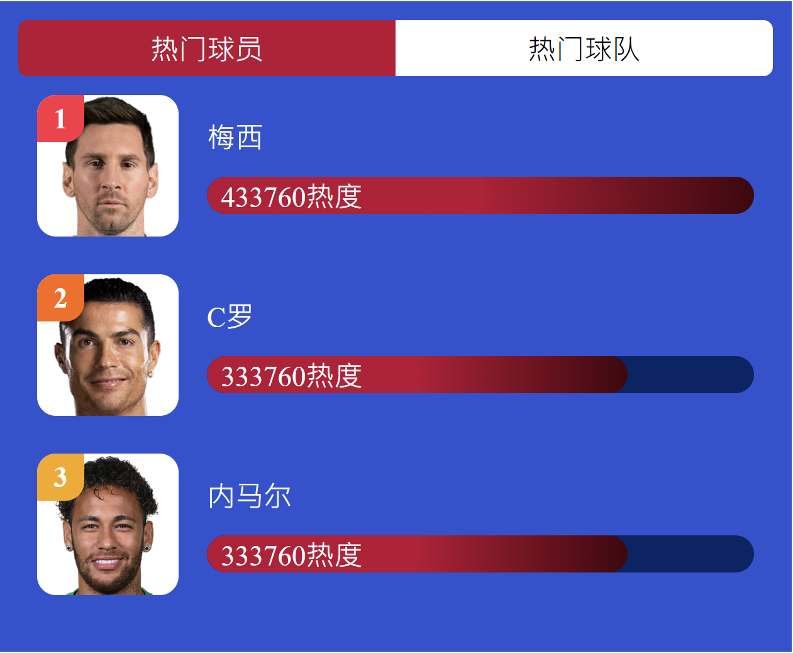
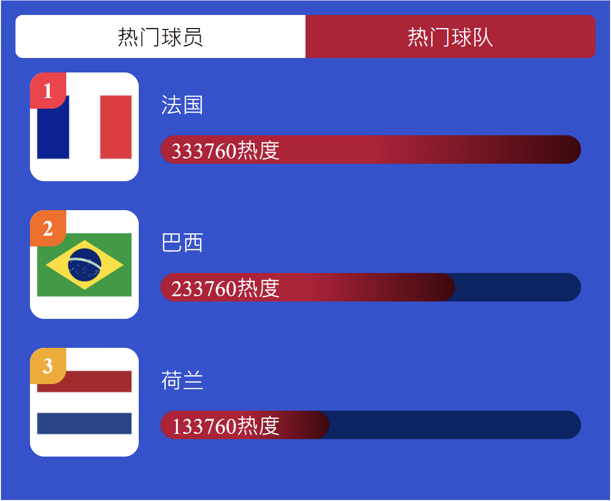

# 第6章 练习：热门球员和热门球队

本章代码详见：`/projects/exercise`，对应视频P27\~P29、P34\~P35、P40\~P41。

## 6.1 功能展示

## 6.2 开发Tips

### 6.2.1 组件的开发注意事项

本节代码详见：`/projects/exercise/v1`

- 子组件中的数据通常不会在子组件中直接定义，通常在创建组件实例时确定，子组件中的数据通常会在创建组件实例时确定！。
- 父组件可以通过props将数据传递给子组件
- 使用props：先在子组件中定义props

### 6.2.2 Tab开发

- `Tab`组件主要的作用就是在多个选项卡之间进行切换，其中显示的主要内容是`TabList`
- `TabList`的数据位于App组件中，通过Tab的slot（插槽）传入（详见第7章的7.5节）

